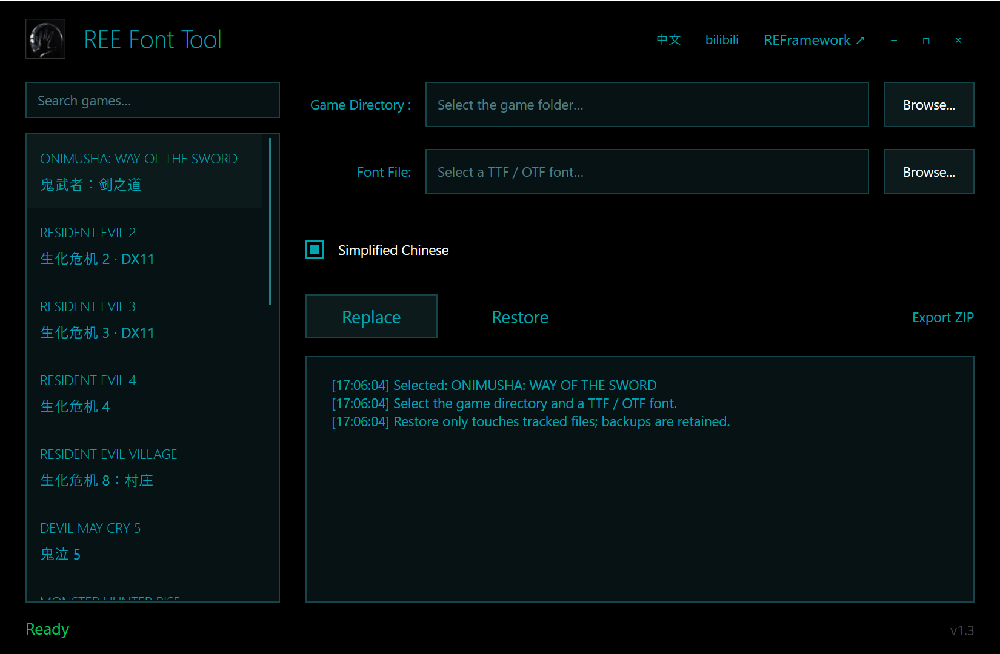

# REE Font Tool

Windows tool for replacing RE Engine `.oft.1` fonts through loose files or exporting a Fluffy Mod Manager ZIP.

用于通过离散文件替换 RE Engine 游戏 `.oft.1` 字体，也可以导出 Fluffy Mod Manager ZIP 模组。

## Features / 功能

- TTF/OTF validation and RE Engine font conversion / TTF、OTF 校验与 RE Engine 字体转换
- Game mappings maintained in `Projects/games.json` / 通过 `Projects/games.json` 维护游戏映射
- Safe replacement with backups, hashes, atomic writes and conflict detection / 带备份、哈希、原子写入和冲突保护的替换与还原
- REFramework Loose File Loader status check / REFramework 离散文件加载状态检查
- Bilingual UI, DPI-aware layout and game search / 中英文界面、DPI 适配与游戏搜索
- Export ZIP packages containing `modinfo.ini`, `screenshot.jpg` and `natives/...` / 导出包含元数据、预览图和字体路径的 ZIP

## Download / 下载

Download the latest Windows x64 ZIP from [GitHub Releases](https://github.com/jakeouyang/REEFontTool/releases). Extract it and keep the `Projects` directory beside the executable.

从 [GitHub Releases](https://github.com/jakeouyang/REEFontTool/releases) 下载 Windows x64 ZIP，解压后请保留 EXE 旁边的 `Projects` 文件夹。

## Requirements / 要求

Windows x64. Font replacement requires a game-compatible [REFramework](https://github.com/praydog/REFramework) installation with Loose File Loader enabled. The tool does not download or install REFramework. Original game PAK files are not modified.

Windows x64。直接替换需要安装适配游戏的 [REFramework](https://github.com/praydog/REFramework)，并开启 Loose File Loader。工具不会自动下载或安装 REFramework，也不会修改原始 PAK 文件。

## Usage / 使用

1. Select a supported game and its game directory.
2. Select a licensed `.ttf` or `.otf` font.
3. Select mapped languages and click Replace, Restore, or Export ZIP.
4. Exit the game before direct replacement. Import exported ZIP files into the matching Fluffy Mod Manager game profile.

1. 选择支持的游戏和游戏目录。
2. 选择有授权的 `.ttf` 或 `.otf` 字体。
3. 选择已映射的语言，然后点击替换、还原或导出 ZIP。
4. 直接替换前请退出游戏；将导出的 ZIP 导入 Fluffy Mod Manager 对应游戏配置。

The exporter writes `modinfo.ini` with the requested author and homepage and creates an informational `screenshot.jpg`. The preview is generated metadata, not a game screenshot.

导出器会写入指定作者、主页和 `modinfo.ini`，并生成信息卡形式的 `screenshot.jpg`。该预览图是模组信息图，不是游戏截图。

## Adding mappings / 添加游戏映射

Edit `Projects/games.json` and add the matching `.list` file. Each entry needs a unique `id`, display names, `list`, Windows game `executables`, and non-empty `fonts.sc`, `fonts.tc`, or `fonts.en` arrays. Every font path must be present in the list, start with `natives/`, and end in `.oft.1`. Do not infer language solely from a filename; validate candidates by extraction, decryption, and in-game testing.

编辑 `Projects/games.json` 并加入对应 `.list`。每项需要唯一 `id`、显示名称、`list`、Windows 游戏 EXE，以及非空的 `fonts.sc`、`fonts.tc` 或 `fonts.en`。字体路径必须存在于 list、以 `natives/` 开头并以 `.oft.1` 结尾。不要仅凭文件名判断语言，应通过提取、解密和游戏内测试确认。

See [ADDING-GAMES.zh-CN.md](ADDING-GAMES.zh-CN.md) and `Projects-audit.csv` for the mapping workflow and list audit.

新增映射流程见 [ADDING-GAMES.zh-CN.md](ADDING-GAMES.zh-CN.md)，列表审计见 `Projects-audit.csv`。

## Build / 构建

Install .NET 9 SDK and run `./build.ps1`. It creates a self-contained single-file Windows x64 build in `Release/`. GitHub Actions runs the same script and attaches `REE.Font.Tool-<tag>-win-x64.zip` to Releases when a `v*` tag is pushed.

安装 .NET 9 SDK 后运行 `./build.ps1`。脚本生成 `Release/` 下的 Windows x64 自包含单文件版本。推送 `v*` 标签时，GitHub Actions 会执行同一脚本并将 ZIP 附加到 Releases。

## Scope and notices / 范围与声明

Mappings are path-level candidates; only the Onimusha simplified-Chinese mapping has been verified in-game. Character coverage does not prove which game language uses a resource. Use fonts you are licensed to distribute. RE Engine, REFramework and game assets belong to their respective authors. This repository contains no proprietary game files or upstream FontsCryptor executable.

当前映射是路径级候选，目前仅确认鬼武者简体中文映射在游戏内生效。字符覆盖不能证明游戏语言用途。请使用有授权的字体。RE Engine、REFramework 和游戏资源归各自作者所有。本仓库不包含游戏文件或上游 FontsCryptor 可执行文件。

## License / 许可证

Source code is available under the MIT License. See [LICENSE](LICENSE). Third-party tools and assets keep their own licenses.

源代码采用 MIT License，见 [LICENSE](LICENSE)。第三方工具和素材遵循各自许可证。

Homepage / 主页: https://space.bilibili.com/8480063
